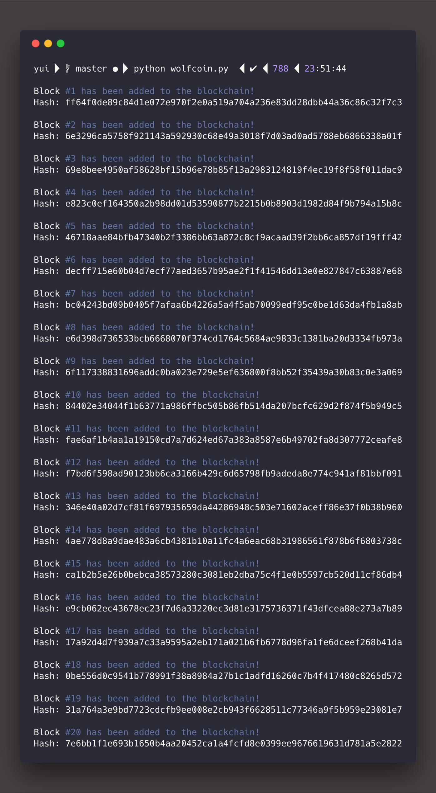

<h3 style="text-align:center;font-weight: 300;" align="center">
  
</h3>

<p align="center">
  
  
  
</p>


> wolfcoin is a Python-based mini-blockchain. The purpose of creating this project is to sharpen my understanding of blockchain's basic. The scope of the project covers hashing generating using the SHA-256 algorithm, and stacking blocks based on a previous hash. The output displays in local terminal setting, no transaction is made using this app.

## Features

🔥 Quick Hashing Display

⚡ Using SHA-256 algorithm to create instant hash

💥 Compacted within 50 Lines of code

🍱 Easy to read/follow code structure.

## External Libraries

Third Party libraries are used in this project

| Package           |   Description |
| ------------- |:-------------:|
| `hashlib`     |  SHA-256 Algorithm Core  |
| `datetime` |  Access real-time date  |

## Getting Started

The user needs to have Terminal/Bash installed, Python version in this project is 2.7.

### Run

🐍 Python 2.7

```bash
$ python wolfcoin.py
```

### Code Walkthrough

In `class Block`: Creating a Block data structure that takes a few args including index, timestamp, a random data that could be anything and most importantly, a previous hash that the newly created block can build upon.

```python
class Block:
    def __init__(self, index, timestamp, data, previous_hash):
        self.index = index
        self.timestamp = timestamp
        self.data = data
        self.previous_hash = previous_hash
        self.hash = self.hash_block()

    def hash_block(self):
        """
        Function Explain.
        hash.update(arg) :Update the hash object with the string arg.
        hash.hexdigest(arg) : Return the digest of the strings passed to the
        update() method so far containing only hexadecimal digits.
        """
        sha = hasher.sha256()
        sha.update(str(self.index) +
                    str(self.timestamp) +
                    str(self.data) +
                    str(self.previous_hash))
        return sha.hexdigest()
```


In `create_genesis_block()`: When a blockchain is initiated, it needs to at least have one block, this function creates the very first block inside of the blockchain that has an arbitrary previous_hash since there is no previous_hash.

```python
def create_genesis_block():
    """
    Manually create the first block with
    index zero and arbitary previous hash
    """
    return Block(0, date.datetime.now(), "Genesis Block", "0")
```


In `def new_block(last_block)`: This function creates the rules on how a new block is created. In a nutshell, it gets previous_hash from the last element in the array, and update its own previous_hash to itself, so later when next block is created, it can read the current hash value.

```python

def new_block(last_block):
    """
    Create new block based on previous block
    """
    this_index = last_block.index + 1
    this_timestamp = date.datetime.now()
    this_data = "Yo! I am block " + str(this_index)
    this_hash = last_block.hash
    return Block(this_index, this_timestamp, this_data, this_hash)
```


In `main`: After creating necessary function, simply create a blockchain, add a genesis block, then loop over 20 times to create 20 blocks. Eventually, print them out, and we are done here.


```python

# Create the genesis within Blockchain
blockchain = [create_genesis_block()]
previous_block = blockchain[0]

# Upper Bound of blocks
blocks_num = 20

# Loop and create 20 subsequent blocks
for i in xrange(0, blocks_num):
    next_block = new_block(previous_block)
    blockchain.append(next_block)
    previous_block = next_block
    print "Block #{} has been added to the blockchain!".format(next_block.index)
    print "Hash: {}\n".format(next_block.hash)

```


## Demo
The blockchain application prints out each hash along with a relative index.




## License

🌱 MIT 🌱

---

>  [yuzhoujr.com](http://www.yuzhoujr.com) &nbsp;&middot;&nbsp;
>   [@yuzhoujr](https://github.com/yuzhoujr) &nbsp;&middot;&nbsp;
>   [@yuzhoujr](https://linkedin.com/in/yuzhoujr)
