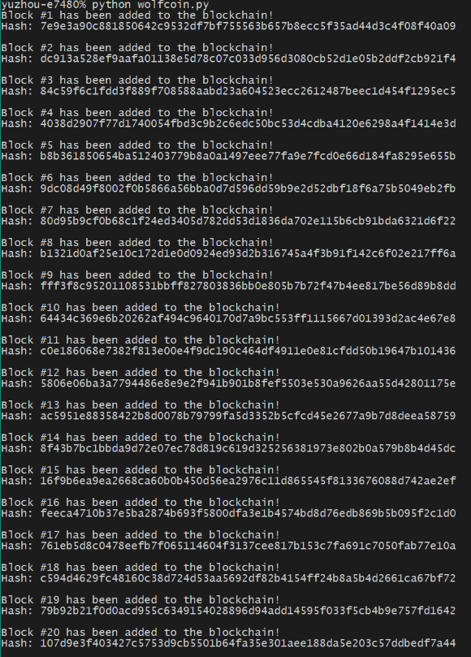

# wolfcoin

<h3 style="text-align:center;font-weight: 300;" align="center">
  
</h3>

<p align="center">
  
  
  
</p>


> wolfcoin is a Python based mini-blockchain.

## Features

⚡️ Quick Hashing Display

🤣 Using SHA-256 algorithm to create instant hash

🎯 Compacted within 50 Lines of code

💫 Easy to read/follow code structure.

## External Libraries

Third Party library are used in this project

| Package           |   Description |
| ------------- |:-------------:|
| `hashlib`     |  SHA-256 Algorithm Core  |
| `datetime` |  Access real-time date  |

## Getting Started

User needs to have Terminal/Bash installed, Python version in this project is 2.7.

### Run

With Python V 2.7

```bash
$ python wolfcoin.py
```

## Demo
The blockchain application will print out each hase along with relative index.




## License

⚡️ MIT

---

> [yuzhoujr.com](https://www.yuzhoujr.com) &nbsp;&middot;&nbsp;
> GitHub [@yuzhoujr](https://github.com/yuzhoujr) &nbsp;&middot;&nbsp;
> LinkedIn [@yuzhoujr](linkedin.com/in/yuzhoujr)
